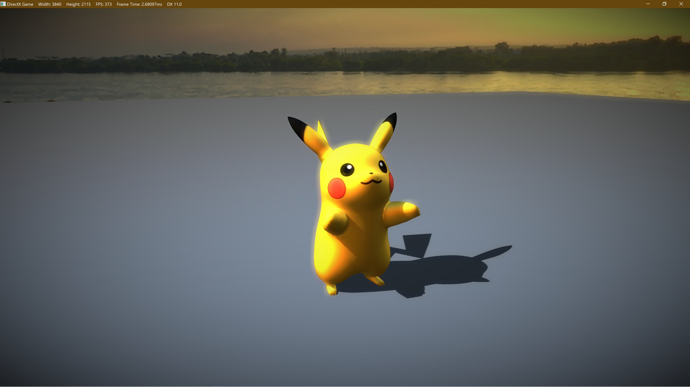
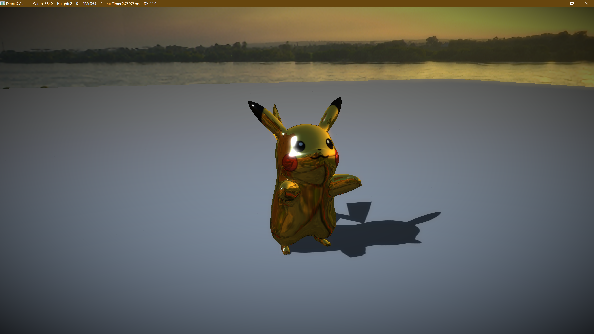

# IGME.740.01 - Game Graphics Programming Individual Assignments

Download 3D models for Assignment 5, 6 and later releases [here](https://github.com/shurunxuan/IGME740_Assignment/releases/download/MDL/models.7z). Put the folder under `IGME740_Assignment\DX11Starter` where you can see the source files. Make sure the `models` folder is not nested with itself.

## Progress

